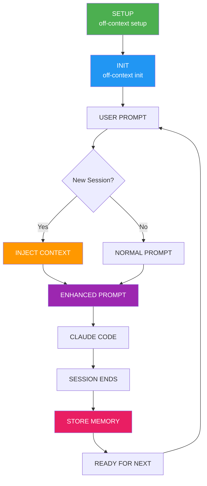

# off-context

[](https://github.com/thiagomendes/off-context-cli/releases)
[](https://github.com/thiagomendes/off-context-cli/actions)
[](LICENSE)

[](https://www.rust-lang.org)
[](https://github.com/thiagomendes/off-context-cli/releases)
[](https://github.com/thiagomendes/off-context-cli/releases)

> **Persistent memory for Claude Code across sessions**

## Overview

Are you a developer who uses Claude Code daily? Or maybe an enthusiastic hobby coder? Either way, you've probably felt the frustration of constantly re-explaining project context, previous decisions, and implementation details across sessions.

**The problem:** Claude Code forgets everything between sessions. You waste time and tokens re-establishing context every single conversation.

**The solution:** off-context gives Claude Code persistent memory with minimal setup and token overhead. No complex MCP configurations, no external services - just simple, local memory that works.

## Key Features

- **Project isolation** - Each project has its own memory database
- **Minimal token overhead** - Only injects relevant context (2-3 recent exchanges)
- **Local-first** - No external services or complex MCP setup required
- **Automatic context injection** - Seamless integration using Claude Code hooks
- **Intelligent search** - Find relevant past conversations instantly
- **Zero configuration** - Works out of the box after simple setup

## Installation

### Quick Install

**Linux/Ubuntu/WSL:**
```bash
curl -sSL https://raw.githubusercontent.com/thiagomendes/off-context-cli/main/install.sh | bash
```

**macOS:**
```bash
curl -sSL https://raw.githubusercontent.com/thiagomendes/off-context-cli/main/install-mac.sh | bash
```

**Manual Install:**
```bash
# Install dependencies
curl --proto '=https' --tlsv1.2 -sSf https://sh.rustup.rs | sh
source ~/.cargo/env
sudo apt-get install jq    # Linux
brew install jq            # macOS

# Build and install
git clone https://github.com/thiagomendes/off-context-cli.git
cd off-context-cli
cargo build --release

# Option 1: Install binary manually
sudo cp target/release/off-context /usr/local/bin/
off-context setup

# Option 2: Use install script with local binary
./install.sh --local target/release/off-context        # Linux
./install-mac.sh --local target/release/off-context    # macOS
```

## Getting Started

### 1. Initialize in your project
```bash
cd your-project
off-context init
```

### 2. Use Claude Code normally
```bash
claude
```

Now Claude Code remembers everything from previous sessions in this project.

## Daily Usage

Just use Claude Code as normal - off-context works transparently in the background:

```bash
claude
```

That's it! The system automatically:
- Captures all conversations
- Injects relevant context from past sessions
- Maintains project-specific memory

## Web Admin Interface

For users who prefer a visual interface, off-context includes a simple web-based admin panel:

### Launch Web Interface

**Prerequisites:** The project must be initialized first with `off-context init`

```bash
cd your-project
off-context init  # Required first time
off-context admin --port 8080
```

Then open http://localhost:8080 in your browser.


## Advanced Usage (Optional)

For power users who want more control:

### Project Management
```bash
# Check project status and memory stats
off-context status

# Launch web admin interface
off-context admin --port 8080

# Search conversation history
off-context search "authentication"

# Reset project memory
off-context reset

# Import existing Claude Code conversations
off-context import

# Export conversations
off-context export --format md

# Remove project hooks
off-context clear
```

## How It Works

1. **Installation** automatically configures global Claude Code hooks
2. **Init** creates project-local memory in `.off-context/`
3. **Smart injection** automatically adds only the most relevant context (typically 2-3 recent exchanges)
4. **Token efficient** - adds ~50-200 tokens per prompt instead of re-explaining everything
5. **Memory** is isolated per project - no cross-contamination

**vs MCP:** No external servers, API keys, or complex configurations. Just local files and Claude Code's built-in hook system.

**vs CLAUDE.md:** Captures dynamic conversations automatically - no need to manually update markdown files with every small detail, temporary decision, or daily troubleshooting session.

### Information Flow Diagram



## Project Structure

```
your-project/
├── .off-context/          # Project memory
│   ├── config.toml        # Local configuration  
│   └── qdrant/            # Conversation database
└── .claude/
    └── settings.local.json # Claude Code hooks
```

## Example

**Without off-context:**
```
Monday: "The payment gateway timeout issue was caused by webhook retries"
Tuesday: "Payment failing again" → Claude suggests generic debugging, you re-explain webhook issue
Friday: "Customer says payment stuck" → You re-explain the timeout/retry problem again
```

**With off-context:**
```  
Monday: "The payment gateway timeout issue was caused by webhook retries"  
Tuesday: "Payment failing again" → Claude immediately checks webhook retry logic
Friday: "Customer says payment stuck" → Claude references Monday's webhook timeout diagnosis
```

## Requirements

- Claude Code

## Uninstall

```bash
curl -sSL https://raw.githubusercontent.com/thiagomendes/off-context-cli/main/uninstall.sh | bash
```

## License

MIT License - see LICENSE file for details.